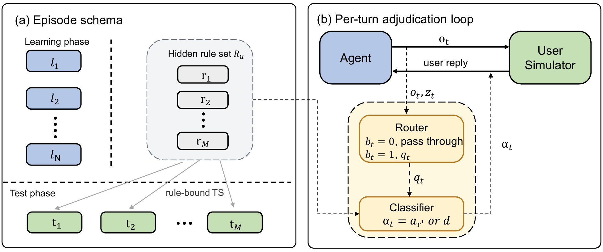

<h1 align="center">ATRBench: Ask-to-Remember Benchmark</h1>

<p align="center">
  <a href="https://openreview.net/forum?id=73Li5tITzy"></a>
  <a href="LICENSE"></a>
  
</p>

<p align="center">
  Code and data for <strong>Ask Now, Use Later: Benchmarking the Proactivity
  Gap in Long-Lived LLM Agents</strong>, accepted as a Main Conference paper
  at EMNLP 2026.
</p>

## Overview

ATRBench evaluates **Ask-to-Remember (ATR)** in long-lived LLM agents. During
learning sessions, an agent can ask for a reusable preference and store the
answer. Later, user-offline test sessions check whether the agent applies that
preference to a tool call.

Each episode contains a hidden rule set, user-online learning sessions, and one
user-offline test session for each rule. The runner freezes the cross-session
context after learning and gives every test session the same snapshot.

<p align="center">
  
</p>

The repository contains the released benchmark episodes, model prompts, local
tool environments, and evaluator. It covers 74 tools across six domains.

The release contains 20 synthetic personas, 284 standing-rule/test-session
pairs, and 568 episode-selected learning sessions. These are the counts used in
the paper.

## Repository layout

```text
assets/       Figure used by this README
data/         Fixed benchmark episodes used in the paper
runner/       Agent execution, user simulation, memory, environments, and prompts
evaluator/    Deterministic trajectory scoring
ontology/     Definitions for the 74 tools
lib/          Model-provider adapters
tools/        Trace inspection utilities
scripts/      Experiment-result aggregation utilities
```

## Installation

ATRBench requires Python 3.10 or later. The commands below use
[`uv`](https://docs.astral.sh/uv/).

```bash
git clone https://github.com/BUPT-GAMMA/ATRBench.git
cd ATRBench
uv sync --locked
```

## Configuration

Copy the environment template and add the required provider keys:

```bash
cp .env.example .env
set -a
. ./.env
set +a
```

The runner reads credentials from environment variables. See
[`.env.example`](.env.example) for provider names and official endpoint
defaults. Non-oracle runs use GPT-5.4 for the user simulator and classifier and
Gemini 3 Flash for the Router, so they require `OPENAI_API_KEY` and
`GEMINI_API_KEY` in addition to the agent model's provider key. Oracle runs
skip the learning phase and require only the agent model's provider key. The
evaluator does not require model API keys.

### Paper models

| Display name | Model ID | Provider key |
|---|---|---|
| GPT-5.4 | `gpt-5.4` | `OPENAI_API_KEY` |
| Claude Opus 4.7 | `claude-opus-4-7` | `ANTHROPIC_API_KEY` |
| Gemini 3 Flash Preview | `gemini-3-flash-preview` | `GEMINI_API_KEY` |
| Gemini 3.1 Pro Preview | `gemini-3.1-pro-preview` | `GEMINI_API_KEY` |
| Qwen3.6-Plus | `qwen3.6-plus` | `DASHSCOPE_API_KEY` |
| MiniMax M2.7 | `MiniMax-M2.7` | `MINIMAX_API_KEY` |
| DeepSeek V4 Pro | `deepseek-v4-pro` | `DEEPSEEK_API_KEY` |
| DeepSeek V4 Flash | `deepseek-v4-flash` | `DEEPSEEK_API_KEY` |

## Quick Start

### 1. Run one benchmark cell

```bash
uv run python -m runner.pipeline \
  --episode data/personas/anna_strahan/episodes/anna_strahan_seed000.json \
  --variant atr \
  --model gpt-5.4 \
  --hook
```

The runner writes trajectories, readable traces, and a cell manifest under
`outputs/`.

### 2. Evaluate the cell

```bash
uv run python -m evaluator.pipeline \
  --episode data/personas/anna_strahan/episodes/anna_strahan_seed000.json \
  --variant atr \
  --model gpt-5.4 \
  --hook
```

The evaluator scores the recorded tool calls against the episode's gold
actions; it does not call a model API.

### 3. Run and evaluate a sweep

```bash
uv run python -m runner.pipeline \
  --personas anna_strahan cassandra_tovar \
  --variants default atr always_ask oracle_target \
  --models gpt-5.4 gemini-3-flash-preview \
  --hook

uv run python -m evaluator.pipeline \
  --personas anna_strahan cassandra_tovar \
  --variants default atr always_ask oracle_target \
  --models gpt-5.4 gemini-3-flash-preview \
  --hook
```

Use `--outputs-root` or `ATR_OUTPUTS_ROOT` to select another output directory.
Pass the same output root to the runner, evaluator, and table builder.

### 4. Build aggregate tables

```bash
uv run python scripts/build_main_tables.py
```

Model runs use paid provider APIs. Preserve each cell manifest when comparing
new runs with the paper because hosted model behavior can change.

## Variants

The paper evaluates four variants on the fixed 20-persona cohort. Each paper
cell is a single trial with a 20-turn cap per session; paper runs use `--hook`
for the user-channel repair described in the runtime protocol. The full sweep
contains `8 models × 4 variants × 20 personas = 640` cells.

| CLI variant | Paper role | Learning phase | Rule information |
|---|---|---|---|
| `default` | `default` | Agent chooses whether to ask | No acquisition guidance |
| `atr` | `atr` | Agent chooses whether and what to ask | Generic Ask-to-Remember scaffold |
| `always_ask` | `always_ask` | One standing-rule question requested after each learning task | Generic Ask-to-Remember scaffold |
| `oracle_target` | `oracle` | Skipped | Test-bound canonical rule injected at test time |

The runtime also exposes `oracle_full`, which injects all rules for a persona as
a broader-context diagnostic. The paper uses `oracle_target`; the main-table
script excludes `oracle_full`. Use `--reasoning {on,off}` to control reasoning
when a provider supports it.

## Data

The v1.0.0 release contains the fixed benchmark episodes used in the paper.
Each episode includes the persona, hidden rules, learning sessions, test
sessions, environments, and metadata consumed by the runner and evaluator.

The personas come from NVIDIA's
[Nemotron-Personas-USA](https://huggingface.co/datasets/nvidia/Nemotron-Personas-USA)
dataset, which uses CC BY 4.0. NVIDIA describes these personas as synthetic.
ATRBench selects and transforms the source records, then adds the rules,
sessions, environments, and episode metadata. The code is released under the
Apache License 2.0; see [LICENSE](LICENSE) and [NOTICE](NOTICE) for the code
license and data attribution details.

### Released data layout

```text
data/personas/<persona_id>/episodes/<persona_id>_seed000.json
```

Each episode embeds the persona, selected rules, learning sessions, and test
sessions consumed by `runner` and `evaluator`.

## Outputs

```text
outputs/<persona>/<episode>/<cell>/
├── cell_manifest.json
├── _cell_done.json
├── trajectories/
├── traces/
├── eval.json
└── run.log

outputs/_summary/       Sweep-level runner and evaluator summaries
```

Given the same episode and trajectory files, the evaluator deterministically
matches recorded tool calls against the episode's gold actions and computes
metrics. It does not call a model API or rerun the Router or Classifier. The
runner uses paid provider APIs for the agent and learning-session simulation,
so repeated runs can vary as hosted models and endpoints change. Keep the
trajectory files and cell manifest with any reported result.

## Citation

```bibtex
@inproceedings{wu2026ask,
  title     = {Ask Now, Use Later: Benchmarking the Proactivity Gap in
               Long-Lived LLM Agents},
  author    = {Wu, Bin and Zou, Guanyun and Wang, Bingbing and Zhao, Huan and
               Shi, Chuan},
  booktitle = {Proceedings of the 2026 Conference on Empirical Methods in
               Natural Language Processing},
  year      = {2026}
}
```
